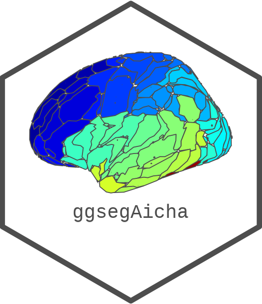
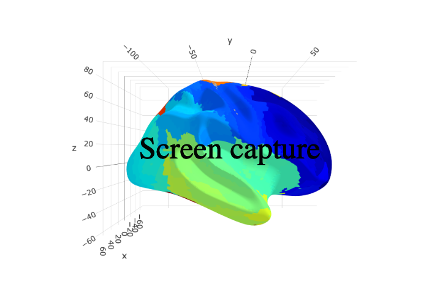

<!-- README.md is generated from README.Rmd. Please edit that file -->

```{r, include = FALSE}
knitr::opts_chunk$set(
  collapse = TRUE,
  comment = "#>",
  fig.path = "man/figures/README-",
  out.width = "100%",
  fig.width = 10, 
  fig.retina = 3
)
```

# ggsegAicha 

<!-- badges: start -->
[](https://github.com/ggseg/ggsegAicha/actions)
<!-- badges: end -->

This package contains dataset for plotting the [aicha](https://pubmed.ncbi.nlm.nih.gov/26213217/) atlas ggseg and ggseg3d. 

Joliot, M., Jobard, G., Naveau, M., Delcroix, N., Petit, L., Zago, L., ... & Tzourio-Mazoyer, N. (2015).
  AICHA: An atlas of intrinsic connectivity of homotopic areas. 
  Journal of neuroscience methods, 254, 46-59.
  (\href{https://pubmed.ncbi.nlm.nih.gov/26213217/}{PubMed})

To learn how to use these atlases, please look at the documentation for [ggseg](https://ggseg.github.io/ggseg/) and [ggseg3d](https://ggseg.github.io/ggseg3d)

## Installation

We recommend installing the ggseg-atlases through the ggseg [r-universe](https://ggseg.r-universe.dev/ui#builds):

```{r eval = FALSE}
# Enable this universe
options(repos = c(
    ggseg = 'https://ggseg.r-universe.dev',
    CRAN = 'https://cloud.r-project.org'))

# Install some packages
install.packages('ggsegAicha')
```

You can install the released version of ggsegAicha from [GitHub](https://github.com/) with:

``` r
# install.packages("remotes")
remotes::install_github("ggseg/ggsegAicha")
```

```{r, fig.height=7}
library(ggseg)
library(ggseg3d)
library(ggsegAicha)

plot(aicha) +
  theme(legend.position = "bottom", 
        legend.text = element_text(size = 9)) +
  guides(fill = guide_legend(ncol = 6))

```

```{r "noneval", eval=FALSE}
library(dplyr)
ggseg3d(atlas = aicha_3d) %>% 
  add_glassbrain() %>% 
  pan_camera("right lateral")
```

```{r "orca", include=FALSE}
library(dplyr)
p <- ggseg3d(atlas = aicha_3d) %>%
  add_glassbrain(hemisphere = "left")%>%
  pan_camera("right lateral") %>%
  plotly::add_annotations( text="Screen capture",
                  legendtitle=TRUE, showarrow=FALSE,
                  font = list(color = "#000000b4",
                              family = 'sans serif',
                              size = 50))
plotly::orca(p, "man/figures/README-3d-plot.png")
```

```{r "incl", echo=FALSE}

```

Please note that the 'ggsegAicha' project is released with a
[Contributor Code of Conduct](CODE_OF_CONDUCT.md).
By contributing to this project, you agree to abide by its terms.
