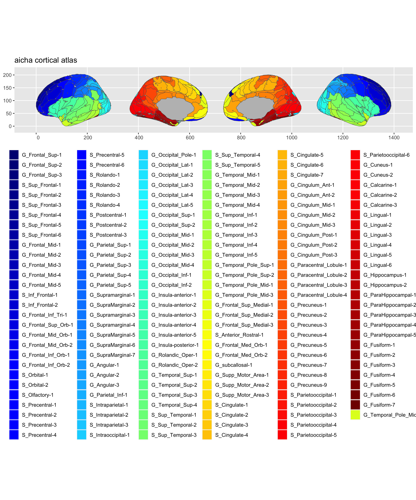

<!-- README.md is generated from README.Rmd. Please edit that file -->

# ggsegAicha 

<!-- badges: start -->

[](https://github.com/ggseg/ggsegAicha/actions)
<!-- badges: end -->

This package contains dataset for plotting the
[aicha](https://pubmed.ncbi.nlm.nih.gov/26213217/) atlas ggseg and
ggseg3d.

Joliot, M., Jobard, G., Naveau, M., Delcroix, N., Petit, L., Zago, L., …
& Tzourio-Mazoyer, N. (2015). AICHA: An atlas of intrinsic connectivity
of homotopic areas. Journal of neuroscience methods, 254, 46-59. ()

To learn how to use these atlases, please look at the documentation for
[ggseg](https://ggseg.github.io/ggseg/) and
[ggseg3d](https://ggseg.github.io/ggseg3d)

## Installation

We recommend installing the ggseg-atlases through the ggseg
[r-universe](https://ggseg.r-universe.dev/ui#builds):

``` r
# Enable this universe
options(repos = c(
    ggseg = 'https://ggseg.r-universe.dev',
    CRAN = 'https://cloud.r-project.org'))

# Install some packages
install.packages('ggsegAicha')
```

You can install the released version of ggsegAicha from
[GitHub](https://github.com/) with:

``` r
# install.packages("remotes")
remotes::install_github("ggseg/ggsegAicha")
```

``` r
library(ggseg)
#> Loading required package: ggplot2
library(ggseg3d)
library(ggsegAicha)

plot(aicha) +
  theme(legend.position = "bottom", 
        legend.text = element_text(size = 9)) +
  guides(fill = guide_legend(ncol = 6))
```



``` r
library(dplyr)
ggseg3d(atlas = aicha_3d) %>% 
  add_glassbrain() %>% 
  pan_camera("right lateral")
```


Please note that the ‘ggsegAicha’ project is released with a
[Contributor Code of Conduct](CODE_OF_CONDUCT.md). By contributing to
this project, you agree to abide by its terms.
